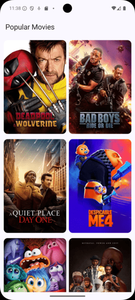
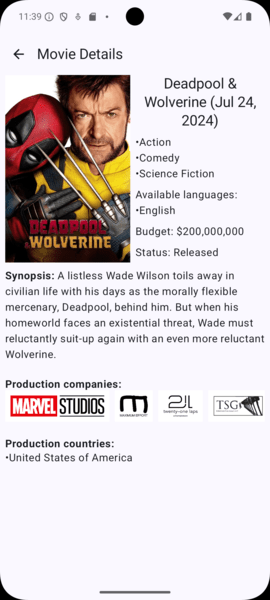

# TMDB - Android

Android-Kotlin based application, which demonstrate knowledge of Android trends such as:
- Kotlin 2.0
- KSP.
- Jetpack Compose, navigation.
- Dependency Injection using AndroidHilt.
- Sealed classes.
- Coroutines & Flows.
- Networking using Retrofit.
- Unit testing.
- Coil: Image Loading Library
- Extension functions.
- Multi-module features.

## Environment Variables

To run this project, you will need to add the following environment variable to a new file called secret.properties file and located it in the root of the project.
Ask for the token, or generate it using the TMDB service.

`API_URL=""`
`ACCESS_TOKEN=""`

## Features

- Light/dark mode support.
- Pull to refresh.
- Network Image Loading.
- State management.

Using the https://api.themoviedb.org/ service to fetch data.

## Screenshots
Home Screen, listing the top popular movies:

Details Movie Screen, information related to the movie:

